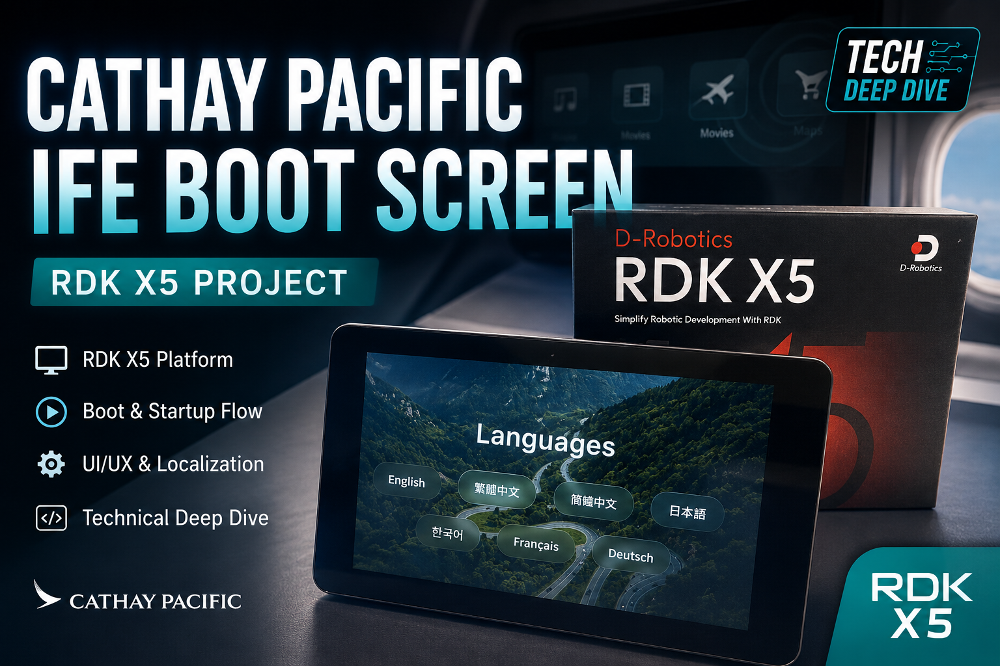

# Cathay Pacific IFE Boot Screen



A replica of the Cathay Pacific in-flight entertainment (IFE) boot screen, running on RDK X5 + 3.5" ST7796S SPI LCD (320×480 portrait).

Pure HTML5 + CSS3 + Vanilla JS — **no build tools, no package manager**. Open `index.html` directly in a browser or serve locally with `python3 -m http.server`.

> **[中文版本](README.zh.md)**

---

## Features

- Boot screen: starfield + 7-language menu (English / 繁體中文 / 简体中文 / 日本語 / 한국어 / Français / Deutsch)
- Split-flap departure board animation for flight info
- 3D globe (Three.js + globe.gl) with programmatic low-poly airplane following great-circle routes
- Day/night shader mixing day and night textures, sun fixed at Hong Kong noon, summer solstice
- 31 real Cathay Pacific destinations
- Camera tracks airplane during flight, zooms in on arrival

---

## Hardware Target

| Item | Value |
|---|---|
| Board | RDK X5 (ARM64, kernel 6.1.83) |
| Display | 3.5" ST7796S SPI LCD, 480×320 landscape |
| Touch | GT911 I2C capacitive touch |
| Display driver | Kernel panel-mipi-dbi DRM, direct fb0 write |
| Browser | Firefox kiosk mode |

Full setup guide for the SPI LCD: **[SPI-LCD-SETUP.md](SPI-LCD-SETUP.md)**.

---

## Quick Start

```bash
python3 -m http.server 8000
# Open http://localhost:8000/index.html
```

Or just double-click `index.html`.

---

## Deploy to RDK X5

Board IP `192.168.128.10`, password `sunrise`, app path `/home/sunrise/cathay_ui/`:

```bash
sshpass -p 'sunrise' rsync -az \
  --exclude='.git' --exclude='node_modules' --exclude='*.mp4' \
  --exclude='frames' --exclude='venv' --exclude='.claude' \
  --exclude='archive' \
  ./ sunrise@192.168.128.10:/home/sunrise/cathay_ui/
```

After syncing, restart the kiosk:

```bash
sshpass -p 'sunrise' ssh sunrise@192.168.128.10 "sudo systemctl restart cathay-kiosk"
```

---

## Architecture

`js/app.js` — 4-state machine:

```
START_SCREEN → GLOBE_SCENE → DEST_REVEAL → GLOBE_ARRIVE
                ↑                                    |
                └────────────────────────────────────┘
                     (auto-cycle next flight, 31 routes)
```

Modules communicate via `window` globals:

| Global | File | Role |
|---|---|---|
| `window.ifeApp` | `js/app.js` | State machine, starfield, rolling text animation |
| `window.GlobeScene` | `js/globe-scene.js` | Globe.gl setup, great-circle routes, 3D airplane, camera |
| `window.SplitFlapBoard` | `js/split-flap.js` | Split-flap departure board (CSS 3D rotateX) |
| `window.installDayNightCycle` | `js/day-night.js` | Day/night shader (globe.gl example port) |

Detail: [CLAUDE.md](CLAUDE.md).

---

## File Structure

### Frontend

```
index.html                  Entry page
css/style.css               All styles
js/
  app.js                    IFEApplication state machine
  globe-scene.js            Globe.gl scene, 3D airplane, camera
  destinations.js           31 HKG routes with multilingual names
  split-flap.js             Split-flap animation (CSS 3D rotateX)
  day-night.js              Day/night shader
assets/                     Textures, starfield, airplane
  earth_daymap_8k.jpg
  earth_nightmap_8k.jpg
  earth_lights_2048.png     City lights (unused, kept as reference)
  earth_atmos_2048.jpg      Backup low-res texture
  plane.png                 Old 2D airplane sprite (unused)
frames/                     Reference video frames for visual comparison
```

### RDK X5 SPI LCD Deployment

```
SPI-LCD-SETUP.md            Full LCD setup + kernel + X11 + touch calibration
generate_st7796s_fw.py      ST7796S init firmware generator
st7796s.bin                 109-byte firmware (rename to panel-mipi-dbi-spi.bin)
overlay-st7796s.dts         LCD device tree overlay source
overlay-st7796s.dtbo        Pre-compiled LCD overlay
overlay-gt911.dts           Touch device tree overlay source
overlay-gt911.dtbo          Pre-compiled touch overlay
kernel-modules/             Pre-built kernel modules (kernel 6.1.83)
  panel-mipi-dbi.ko         DRM panel driver (463K)
  drm_mipi_dbi.ko           DRM MIPI DBI module with ST7796S reset timing fix (550K)
```

### Deployment / Autostart

```
autostart-kiosh.sh          Startup script (referenced by systemd)
cathay-kiosk.desktop        XDG autostart entry (legacy)
Makefile                    Deploy helper
```

### Docs

```
README.md                   This file
CLAUDE.md                   Project instructions for Claude Code
SPI-LCD-SETUP.md            SPI LCD full setup tutorial
```

### Archive (deprecated)

```
archive/                    Old userspace SPI/touch drivers, test scripts
  README.md                 Archive contents and replacement references
```


## References

- [globe.gl day-night-cycle example](https://globe.gl/example/day-night-cycle/)
- [Three.js](https://threejs.org/)
- [panel-mipi-dbi driver source](https://github.com/torvalds/linux/blob/master/drivers/gpu/drm/tiny/panel-mipi-dbi.c)